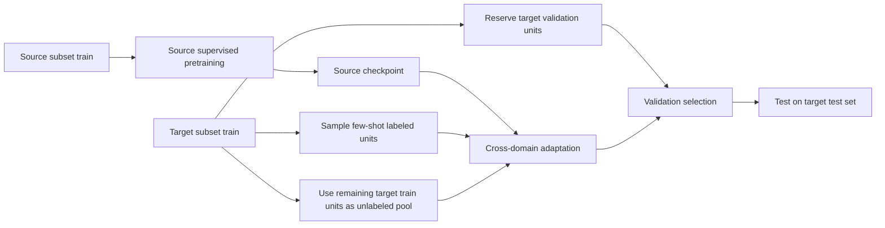
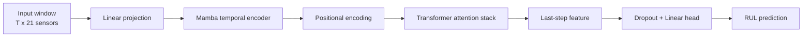
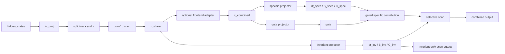

# CD-MambAtt 详细阶段汇报

更新时间：`2026-04-13`

说明：

- 本版只保留 `Markdown`，不再生成 `PDF`。
- 这份报告的目标不是堆很多曲线，而是把三件事讲清楚：
  1. 我们现在到底在做什么；
  2. 当前模型具体长什么样，和原始 `MambAtt` 有什么关系；
  3. 我们到目前为止做过哪些实验、结果如何、真正卡在哪里。

---

## 1. 项目目标与当前问题

本项目的核心任务不是单纯复现论文，而是：

> 以 `MambAtt` 为骨干，在 `C-MAPSS` 上做跨域 few-shot RUL 预测。

更具体地说：

- 在 source domain 上先学退化规律；
- 迁移到 target domain；
- target domain 只有极少标注样本，例如 `5-shot`；
- 同时尽量利用 target train 中剩余的 unlabeled 数据；
- 目标是显著优于 direct transfer 和简单 few-shot finetune。

当前阶段我们真正要回答的问题已经变成：

1. 原始 `MambAtt` 骨干我们到底复现到了什么程度；
2. 跨域提升主要来自哪里；
3. 我们后续大量加 loss 的努力，哪些是真的有效，哪些已经被证据否定；
4. 当前瓶颈到底在 loss 设计、backbone 表征，还是任务本身的适配难度。

---

## 2. 数据、任务与协议

### 2.1 数据集

主要使用 NASA `C-MAPSS`：

- `FD001`
- `FD002`
- `FD003`
- `FD004`

这些子集在工况数、故障模式数、分布形态上不同，因此天然构成跨域迁移任务。

### 2.2 目前最重要的任务

当前项目里最关键的 transfer pair 包括：

| 任务 | 作用 |
| --- | --- |
| `FD001 -> FD003` | canonical 主任务，绝大多数方法先在这里验证 |
| `FD003 -> FD001` | 难任务，常用来检查“canonical 上的提升是否能泛化” |
| `FD001 -> FD004` | 更强 domain shift，当前很多方法会在这里暴露问题 |
| `FD002 -> FD004` / `FD004 -> FD002` / `FD001 -> FD002` | 多任务补充验证 |

### 2.3 当前默认数据协议

- 输入：`21 sensors`
- `window_size = 20`
- `stride = 1`
- `RUL cap = 125`
- source 侧：engine-level `80/20` train/val split
- target 侧：典型设置为 `5-shot + 10 val units + 剩余 unlabeled units`

### 2.4 整体训练流程



这张图对应我们现在大多数跨域脚本的共同骨架：

- `train_cross_domain_baseline.py`
- `train_cd_mambatt_v1.py`
- `train_cd_mambatt_v2.py`
- `train_cd_mambatt_v3.py`

---

## 3. 原始 MambAtt 论文结构

这一节只围绕我们真正采用的底座模型：`MambAtt`。

### 3.1 论文结构的直观理解

可以把原始 `MambAtt` 理解为：

> 先用 `Mamba` 建模时序递推，再用 `Attention` 做全局关系重整，最后回归 RUL。

下面的图是根据原论文结构重绘的简化示意：



### 3.2 这个结构为什么适合 RUL

- `Mamba` 负责顺着时间推进，提取退化轨迹的递推模式；
- `Transformer` 负责重新看整个窗口内各时间步之间的关系；
- 最后的回归头输出当前窗口对应的 RUL。

因此，原始 `MambAtt` 的本质不是一个很复杂的多分支系统，而是一个非常清楚的串联结构：

> `sensor window -> Mamba -> attention -> regression`

这点很重要，因为它决定了后面很多“跨域方法”其实并没有真正改动 backbone，只是在训练目标上做文章。

---

## 4. 我们当前代码中的 MambAtt 复现结构

### 4.1 代码落点

当前主模型定义在：

- `cd_mambatt/models/mambatt.py`

其中关键模块如下：

| 模块 | 代码位置 | 作用 |
| --- | --- | --- |
| `PositionalEncoding` | `mambatt.py` lines `12-24` | 在进入 attention 前加入位置信息 |
| `MambaBlock` | `mambatt.py` lines `26-43` | 对原始 Mamba 的薄封装 |
| `ResidualMambaBlock` | `mambatt.py` lines `46-65` | 我们试过的额外 pre-norm residual 包装 |
| `TransformerBlock` | `mambatt.py` lines `67-187` | 自定义 attention + FFN block |
| `TorchTransformerStack` | `mambatt.py` lines `190-213` | PyTorch 原生 Transformer 备选实现 |
| `MambAttRegressor` | `mambatt.py` lines `216-490` | 当前单路径主模型 |
| `DDMambaBlock` | `dd_mamba.py` lines `11-412` | 后续 `SPD / DD-SSM` 的核心改造 |

### 4.2 当前复现版 backbone 的真实结构

从代码实现看，`MambAttRegressor` 的默认主干是：


与论文结构一致的地方：

- 输入是滑动窗口；
- 先经过 `Mamba`；
- 再经过 position encoding + attention stack；
- 用最后时刻的 feature 做回归。

### 4.3 我们当前复现中最关键的实现选择

当前监督复现最强配置不是论文原文逐字显式写出的唯一配置，而是基于控制实验后确定的“最可信实现”：

- `d_model = 21`
- `d_state = 16`
- `d_conv = 8`
- `expand = 2`
- `num_mamba_layers = 1`
- `num_transformer_layers = 3`
- `num_heads = 7`
- `dim_feedforward = 84`
- `dropout = 0.5`
- `transformer_impl = custom`
- `transformer_norm_mode = post`
- `mamba_block_mode = bare`
- `val_all_windows = True`

这些参数的训练入口主要在：

- `train_supervised.py`

### 4.4 我们复现版和论文之间的边界

当前可以明确说：

- **结构级复现已经完成**；
- 但 **数值级复现还没到论文水平**。

目前本地最好监督结果：

| 指标 | 结果 |
| --- | ---: |
| Paper `FD001 supervised` | `11.46` |
| Local best fixed split | `15.0937` |
| Local best resampled split | `15.3024` |

这说明我们后面所有跨域实验都建立在一个“能用、但还不是 paper-level 最强”的 source backbone 上。

---

## 5. 从 MambAtt 到 CD-MambAtt：我们到底改了什么

这一节最关键，因为它直接回答：

> 我们后面的工作，哪些是在改 backbone，哪些只是改训练目标。

### 5.1 Stage 0：跨域 baseline

最早的 baseline 在：

- `train_cross_domain_baseline.py`

做的事非常简单：

1. 先在 source 上监督训练；
2. 再把模型迁移到 target；
3. 用 target 的 few-shot 标注做 finetune；
4. 没有任何 unlabeled 对齐机制。

这一步的意义是建立最原始的参考线：

- direct transfer 到底有多差；
- target few-shot supervision 本身能恢复多少。

### 5.2 Stage 1：`CD-MambAtt v1 = MMD`

`v1` 对应：

- `train_cd_mambatt_v1.py`

这一版并没有改 backbone，改的是 adaptation stage 的损失：

```text
L_v1 =
    w_src * L_source_reg
  + w_tgt * L_target_reg
  + lambda_mmd * L_mmd
```

直观理解：

- source 有监督；
- target few-shot 有监督；
- target unlabeled 通过 `MMD` 参与训练；
- 目标是把 source / target feature 拉近。

重要的是：

> `v1` 的本质是“在原始 MambAtt feature 上做全局分布对齐”，不是改了 Mamba 内部结构。

### 5.3 Stage 2：`CD-MambAtt v2 = MMD + pseudo + monotonic`

`v2` 对应：

- `train_cd_mambatt_v2.py`

这一版增加了三个关键东西：

1. `source-stage classification`
2. `target pseudo-stage classification`
3. `local monotonicity loss`

可以写成：

```text
L_v2 =
    w_src * L_source_reg
  + w_tgt * L_target_reg
  + lambda_mmd * L_mmd
  + lambda_stage * L_source_stage_ce
  + lambda_pseudo * L_target_pseudo_ce
  + lambda_mono * L_monotonic
```

每一项直观意义如下：

| 项 | 作用 |
| --- | --- |
| `L_source_reg` | 让 source 监督信号继续约束模型 |
| `L_target_reg` | 用 few-shot 目标域标注直接学习 |
| `L_mmd` | 做 source/target feature 对齐 |
| `L_source_stage_ce` | 用 source 的阶段标签强化退化阶段结构 |
| `L_target_pseudo_ce` | 给 unlabeled target 分配伪阶段标签后参与训练 |
| `L_monotonic` | 利用 RUL 局部单调递减先验 |

但要强调：

> 到 `v2` 为止，我们的绝大多数改动依然是 loss-level 的，backbone 仍然基本是原始 `MambAtt`。

这正是后面“为什么 MMD 后平台期明显”的核心背景。

### 5.4 Stage 3：`CD-MambAtt v3 = SPD / DD-SSM`

真正开始改 backbone 内部结构的是：

- `train_cd_mambatt_v3.py`
- `cd_mambatt/models/dd_mamba.py`

这条线的核心思想是：

> 不再只在最后 feature 上做域对齐，而是进入 Mamba 的选择性状态空间生成过程中，把“域不变信息”和“域特定信息”拆开。

也就是说，`v3` 才是我们最主要的“结构创新线”。

---

## 6. SPD / DD-Mamba 结构到底是什么

### 6.1 为什么要做 SPD

从前期诊断看，原始 Mamba 在跨域时有两个问题：

1. 共享前端很早就被域信息污染；
2. 递推状态对输入分布偏移很敏感，可能把微小 domain shift 沿时间步放大。

因此 SPD 的设计目标是：

- 给 invariant path 一个更稳定的出口；
- 允许 model 保留一小部分 domain-specific 信息；
- 通过 gate 决定 specific branch 参与多少；
- 把真正要对齐的对象尽量换成 invariant path，而不是整个混合 feature。

### 6.2 SPD block 的内部结构

下面是根据当前代码重绘的 `DDMambaBlock` 结构示意：



### 6.3 对应到代码层面的真实改动

在 `dd_mamba.py` 中，关键设计如下：

1. **保留原始 Mamba 主干**
   - 原始 `in_proj / conv1d / A_log / D / out_proj` 仍保留。

2. **invariant branch**
   - 直接复用原始 `x_proj` 和 `dt_proj`。
   - 这条路尽量靠近原始 Mamba。

3. **specific branch**
   - 新增 `x_proj_spec` 和 `dt_proj_spec`。
   - 初始值接近零，避免一开始破坏原模型行为。

4. **gate**
   - 用一个很轻量的门控决定 specific branch 注入多少。
   - 可选 shared gate，或 `dt / B,C` 分开的 gate。

5. **frontend adapter**
   - 可选地在 `conv1d` 之后、进入 selectivity 投影之前，给 target 加一个前端修正。

6. **dual outputs**
   - block 不只输出 combined path；
   - 还可以返回 invariant path、gate 均值、frontend feature 等辅助量。

### 6.4 这意味着什么

和 `v1 / v2` 相比，`v3` 的最大不同是：

> 之前是“保持 backbone 不动，在输出 feature 上对齐”；  
> `v3` 是“直接改 backbone 的内部状态生成方式”。

所以如果我们要讲创新点，真正有结构分量的主线其实主要就是 SPD。

---

## 7. 我们后续的结构补丁改在了哪里

除了 SPD 主体，我们后续还加过一些可选结构钩子，主要都在 `train_cd_mambatt_v3.py` 和 `dd_mamba.py` / `mambatt.py` 中。

### 7.1 Frontend adapter

位置：

- `DDMambaBlock` 的 `conv1d` 之后

目的：

- 在 very early feature level 修正 target 的 domain shift。

可选模式：

- `none`
- `target_affine`
- `target_residual`

### 7.2 Domain-conditioned gate

位置：

- SPD gate 上额外加 domain-conditioned shift

目的：

- 让 source / target 在 specific branch 的打开程度上可以有不同偏置。

### 7.3 Transformer domain adapter

位置：

- 每个自定义 `TransformerBlock` 的 LayerNorm 之后

目的：

- 在 attention 端加入轻量 target-conditioned shift/FiLM。

可选模式：

- `none`
- `target_shift`
- `target_film`

### 7.4 Predictor decomposition

位置：

- `MambAttRegressor` 的 head 部分

尝试过的模式：

- `shared_head`
- `decomposed_residual`
- `shared_aux_residual`

其中：

- `shared_head` 最稳定；
- 过强的 hard decomposition 后来并没有成为 maintained path。

---

## 8. 结构层修改 vs 损失层修改：一张表讲清楚

| 版本/模块 | 是不是改 backbone | 改在哪里 | 本质 |
| --- | --- | --- | --- |
| baseline few-shot finetune | 否 | 训练流程 | 只改 source->target 训练方式 |
| `v1` MMD | 否 | adaptation loss | 在最终 feature 上加全局分布对齐 |
| `v2` pseudo + monotonic | 否 | adaptation loss | 加阶段伪标签与单调先验 |
| `source-stage head` | 否 | 训练头部 | 给 feature 一个阶段分类约束 |
| `SPD / DD-Mamba` | 是 | Mamba block 内部 | 拆 invariant / specific 生成路径 |
| frontend adapter | 是 | Mamba `conv1d` 后 | 做 early feature 域修正 |
| domain-conditioned gate | 是 | SPD gate | 改 specific 注入策略 |
| transformer domain adapter | 是 | attention block 内 | 在 decoder 端做轻量 target 条件化 |

这张表实际上解释了我们近期最重要的反思：

> 从 `v1` 开始，`MMD` 已经把最容易拿到的 feature-level 对齐收益吃掉了；  
> 后面很多工作虽然看上去复杂，但本质上仍然只是围绕 loss 在做局部修补。

---

## 9. 当前维护的损失函数形式

在经历多轮实验之后，当前 `v3` 主线已经把很多无效 loss 从 maintained path 中清掉了。

### 9.1 当前保留的核心目标

当前维护版目标可以写成：

```text
L_total =
    w_src * L_source_reg
  + w_tgt * L_target_reg
  + lambda_mmd * L_global_mmd
  + lambda_stage * L_source_stage_ce
  + lambda_pseudo * L_target_pseudo_ce
  + lambda_mono * L_local_monotonic
  + lambda_inv * L_invariant_mmd
  + lambda_spec * L_specific_domain_ce
  + lambda_adapter * L_transformer_adapter_l2
```

其中前三到六项是 `v2` 主线，后面三项主要服务于 `SPD / v3`。

### 9.2 当前保留的默认理解

真正长期稳定有效、已经有证据支持的主干项是：

- source supervised regression
- target few-shot regression
- global `MMD`
- source-stage supervision
- target pseudo-stage supervision
- local monotonicity

### 9.3 已经从 maintained path 退役的东西

| 方向 | 当前结论 |
| --- | --- |
| cross-domain contrastive | 多次实验无稳定收益，已退役 |
| GRL / domain-adversarial | 不如直接 invariant-MMD，已退役 |
| inv/spec orthogonality 等 semantic-SPD 辅助族 | 高投入低回报，已退役 |
| 复杂语义 warmup / reconstruction 类辅助项 | 没有形成 maintained 优势，已归档 |

这一点对后续开发非常重要，因为它意味着：

> 我们现在不是没有 loss，而是已经有足够多的证据说明“继续往 loss 家族横向扩张”不是首选方向。

---

## 10. 关键实验记录与结果

这一节只保留对当前判断真正重要的结果。

### 10.1 单域监督与 target oracle

| 指标 | RMSE |
| --- | ---: |
| Paper `FD001 supervised` | `11.46` |
| Local `FD001 supervised` fixed split | `15.0937` |
| Local `FD001 supervised` resampled split | `15.3024` |
| `FD003` target oracle | `14.1128` |
| `FD004` target oracle | `16.4495` |

这组数字说明：

1. source backbone 还没有到 paper-level；
2. 但 target oracle 也明显低于当前 cross-domain few-shot 结果；
3. 所以“source 骨干不够强”是真问题，但**不是唯一问题**。

### 10.2 当前稳定的多任务 cross-domain 主线结果

下面这张表对应当前最稳定、最可复核的 `CD-MambAtt v2` 主线：

| 任务 | Direct transfer | CD-MambAtt v2 | Gain |
| --- | ---: | ---: | ---: |
| `FD001 -> FD003` | `34.8204` | `21.9608` | `12.8595` |
| `FD003 -> FD001` | `24.6059` | `19.8137` | `4.7922` |
| `FD002 -> FD004` | `29.5028` | `22.1776` | `7.3252` |
| `FD001 -> FD004` | `32.3820` | `24.3449` | `8.0371` |
| `FD004 -> FD002` | `21.3666` | `19.5311` | `1.8354` |
| `FD001 -> FD002` | `31.1029` | `22.9457` | `8.1572` |

支持的结论是：

- 跨域路线本身成立；
- 不是只在一个任务上偶然有效；
- `v2` 仍然是当前最稳的多任务基线。

### 10.3 canonical 任务上的后续结构分支

如果只看 `FD001 -> FD003`，我们后来确实拿到过更强的分支：

| 分支 | 结果 | 备注 |
| --- | ---: | --- |
| stable `v2` 5-seed | `21.9608` | 当前稳健主线 |
| SPD high-LR non-SSL | `20.37 ± 0.47` | 3-seed，canonical 明显有效 |
| union SSL + no-spec | `19.8483 ± 1.1460` | 3-seed 曾经最好，但 5-seed 后不再稳健 |
| plain no-spec 5-seed | `20.8917 ± 2.2820` | 当前 canonical 稳定参考 |

这组结果的正确解读不是“我们已经稳定到 19.8”，而是：

- canonical 上确实出现过更低数字；
- 但扩到更多 seed 或更难 transfer pair 后，很多优势并不稳；
- 因此不能把单个 canonical best 当成整个项目的真实上限。

### 10.4 最新三段式分解：真正是谁在起作用

为了避免把不同因素混在一起，我们后来补了 matched control：

- `target-only 5-shot`
- `source-init-only 5-shot`
- `full cross-domain adaptation`
- `target oracle`

结果如下：

| 任务 | Target-only | Source-init-only | Full CD | Target oracle |
| --- | ---: | ---: | ---: | ---: |
| `FD001 -> FD003` | `22.4650` | `21.9354` | `20.6220` | `14.1128` |
| `FD001 -> FD004` | `24.7623` | `23.8626` | `24.3449` | `16.4495` |

这张表非常关键，因为它把收益来源拆开了：

#### 对 `FD001 -> FD003`

- target few-shot 标注本身已经很有用：`22.47`
- source init 再给一点帮助：`22.47 -> 21.94`
- full CD 再进一步：`21.94 -> 20.62`

#### 对 `FD001 -> FD004`

- target few-shot 标注本身仍然最重要：`24.76`
- source init 有帮助：`24.76 -> 23.86`
- 但 full CD 反而略退化：`23.86 -> 24.34`

这说明当前 adaptation objective 的价值已经明显**任务相关**，不是“加上就一定更好”。

### 10.5 `FD001 -> FD004` loss family 分解

这是我们最近最重要的一组反思性结果，因为它直接回答：

> 后续加的这些 loss，到底是不是在做无用功？

| 变体 | Mean test RMSE | 相对 `source-init-only` 变化 |
| --- | ---: | ---: |
| `source-init only` | `23.8626` | `0.0000` |
| `monotonic only` | `24.0628` | `+0.2001` |
| `pseudo only` | `24.0896` | `+0.2270` |
| `source-stage only` | `24.1942` | `+0.3316` |
| `source-stage + pseudo` | `24.1967` | `+0.3341` |
| `MMD only` | `24.2065` | `+0.3438` |
| `full CD` | `24.3449` | `+0.4822` |

这组结果支持的结论很明确：

- `FD001 -> FD004` 当前回退 **不是某一条 loss 单独写坏**；
- 所有保留项都只是在同一个平台附近做小扰动；
- 没有任何一项在这条任务上稳定超过 `source-init-only`。

所以，如果只围绕 `FD001 -> FD004` 来看：

> 后续很多 loss-level 努力，确实没有产生我们原本期待的有效增量。

---

## 11. 这是否说明我们在 MMD 之后走偏了

这个问题现在可以比较坦率地回答：

### 11.1 被证据支持的部分

是的，**有相当一部分后续努力没有改变问题本质**。

原因不是“这些工作完全无意义”，而是：

1. `MMD` 已经拿走了最容易拿到的全局 feature 对齐收益；
2. 后续很多方法仍然停留在 loss-space 的加法；
3. 它们没有真正改变 backbone 的表征生成方式；
4. 所以多数结果都在相近区间徘徊。

### 11.2 但不能过度简化成一句话

也不能简单说：

> “MMD 后面所有工作都是无用功。”

因为仍然有几条线给出了真实信息：

- `pseudo + monotonic` 让 `v2` 成为稳定主线；
- `SPD` 证明“改 Mamba 内部机制”在 canonical 上是有收益的；
- `union SSL` 证明“稳定状态动力学”可能比“再加一个 loss”更关键；
- `matched decomposition` 明确告诉我们收益主要来自 few-shot supervision 和 source init。

更准确的说法应该是：

> `MMD` 之后，继续沿着“堆新 loss”这条路的边际收益已经非常小；  
> 真正值得继续投入的方向，应该是 backbone 表征质量、状态动力学稳定性，以及任务相关的 adaptation 机制。

---

## 12. 当前困境到底在哪里

### 12.1 困境一：source backbone 还有明显 gap

证据：

- Paper `FD001 supervised = 11.46`
- Local best `FD001 supervised = 15.09`

这说明 source 预训练本身还不够强，可能会压低后续 source initialization 的质量。

### 12.2 困境二：target oracle 还很远

证据：

- `FD003 oracle = 14.11`，而当前 full CD 约 `20.62`
- `FD004 oracle = 16.45`，而当前 full CD 约 `24.34`

这说明：

- 即使不考虑论文数字，我们当前 few-shot transfer 离 target-domain upper bound 也还差很大一截；
- 这部分 headroom 不能简单归因于 source backbone gap。

### 12.3 困境三：adaptation objective 开始表现出强任务相关性

证据：

- `FD001 -> FD003` 上，full CD 相对 source-init-only 有增益；
- `FD001 -> FD004` 上，full CD 相对 source-init-only 略退化。

这说明当前问题不再是“这套 objective 有没有用”，而是：

> 它为什么在某些任务上有用，在另一些任务上反而有副作用。

### 12.4 困境四：大量复杂 loss 没有换来新的 level

证据：

- `FD001 -> FD004` loss 分解里，没有一项超过 `source-init-only`；
- contrastive、GRL、semantic-SPD 辅助家族都已被退役。

所以当前 project 的主矛盾已经不是：

> “还缺哪个 loss”

而更像：

> “当前 backbone 产生的表示，是否已经到了 loss 再怎么修也抬不动的阶段”

---

## 13. 现在已经可以明确说的结论

### 13.1 已被证据支持的结论

1. `CD-MambAtt` 作为跨域 few-shot 方法是成立的，不是偶然现象。
2. `MMD` 是有效的，但收益有限，属于次级增益源。
3. `v2 = MMD + pseudo + monotonic` 仍然是当前最稳的多任务主线。
4. 后续很多 loss-family 扩张没有带来新的稳定水平。
5. `SPD / DD-Mamba` 是当前最主要的结构创新线，而不是又一条 loss 线。
6. `SPD` 在 canonical 任务上有效，但还不是跨任务的统一答案。
7. source backbone gap 真实存在，而且不应被忽略。
8. target oracle gap 同样巨大，因此 transfer ceiling 不能只怪 source 监督复现不足。
9. 当前 adaptation 收益已经明显任务相关。

### 13.2 目前只是推测、仍需验证的解释

1. 当前主要瓶颈可能已经从 loss 设计转向表征质量。
2. Mamba 的状态递推稳定性可能是关键上限之一。
3. `FD004` 更像在暴露 task/partition sensitivity，而不是某个 loss 的单点错误。
4. 如果 source supervised 结果能继续明显逼近论文，cross-domain ceiling 很可能整体抬高。

这些判断是合理推断，但它们还不是“已经被证明”的结论。

---

## 14. 下一步应该怎么做

按照现在的证据，后续工作应该按下面的优先级推进。

### 14.1 第一优先级：先把 source backbone 问题拆清楚

目标：

- 继续追查 `15.09 -> 11.46` 的 gap 到底来自哪里；
- 不是盲目加结构，而是把 source supervised 复现继续做实。

原因：

- 这是影响所有 transfer path 的底座问题；
- 如果 source checkpoint 本身更强，source-init-only 与 full CD 都可能水涨船高。

### 14.2 第二优先级：把 adaptation 的任务相关性做成明确诊断

重点任务：

- `FD001 -> FD004`
- `FD003 -> FD001`

目标：

- 解释为什么同一 objective 在 `FD003` 帮忙、在 `FD004` 退化；
- 优先从 early adaptation dynamics、front-end shift、invariant path 稳定性入手。

### 14.3 第三优先级：优先做结构级轻量验证，不再默认扩张 loss

更值得做的方向：

- state / feature normalization
- 更短窗口或更稳的递推长度控制
- 更明确的前端域修正
- 直接检验 backbone 表征质量的提升能否带动迁移

不应再作为默认动作的方向：

- 没有机制证据支撑的新 auxiliary loss
- 再做一整族 semantic-SPD 辅助项扩张

---

## 15. 汇报时可以直接说的短版本

如果需要在组会上用几句话讲清楚当前状态，可以直接说：

> 我们当前是在 `MambAtt` 骨干上做 `C-MAPSS` 的跨域 few-shot RUL 预测。原始 `MambAtt` 的结构已经在本地完成复现，当前骨干仍能在 `FD001` 上做到约 `15.09` RMSE，但和论文 `11.46` 还有 gap。在此基础上，我们已经建立了一条稳定的跨域主线 `CD-MambAtt v2`，核心由 `MMD + pseudo-stage + monotonic` 组成，并在多个 transfer pair 上稳定优于 direct transfer。后续我们真正的结构创新是把 Mamba 内部改成 `SPD / DD-Mamba`，在内部拆 invariant / specific 分支并加入 gate 与前端适配器；这条线在 canonical 任务上有收益，但还没有成为跨任务统一最优。最新的 matched control 说明，当前跨域收益主要来自 target few-shot supervision 和 source initialization，而 full adaptation 的额外价值已经呈现强任务相关性。综合这些证据，我们判断后续不应再默认扩张 loss，而应优先转向 source backbone gap、状态动力学稳定性和 harder transfer task 上的定向诊断。 

---

## 16. 相关代码与文档入口

### 16.1 主要代码

- `cd_mambatt/models/mambatt.py`
- `cd_mambatt/models/dd_mamba.py`
- `train_supervised.py`
- `train_cross_domain_baseline.py`
- `train_cd_mambatt_v1.py`
- `train_cd_mambatt_v2.py`
- `train_cd_mambatt_v3.py`

### 16.2 主要实验记录

- `docs/supervised_reproduction.md`
- `docs/cross_domain_experiment_log.md`
- `docs/project_status.md`
- `docs/project_overview_zh_2026-04-08.md`
- `docs/reflection_benchmark_2026-04-12.md`
- `docs/technical_appendix_zh_2026-04-11.md`

---

## 17. 结论

到目前为止，这个项目最重要的事实不是“我们没有方法”，而是：

1. 我们已经有一条成立的跨域 few-shot 主线；
2. 真正的 backbone 级创新也已经做出来了，就是 `SPD / DD-Mamba`；
3. 但后续很多围绕 loss 的扩张没有改变平台期；
4. 当前最值得投入的地方，已经从“再加一个 loss”转向“把 backbone 与 adaptation 机制拆清楚”。

这也是这份报告最想表达的核心判断。
